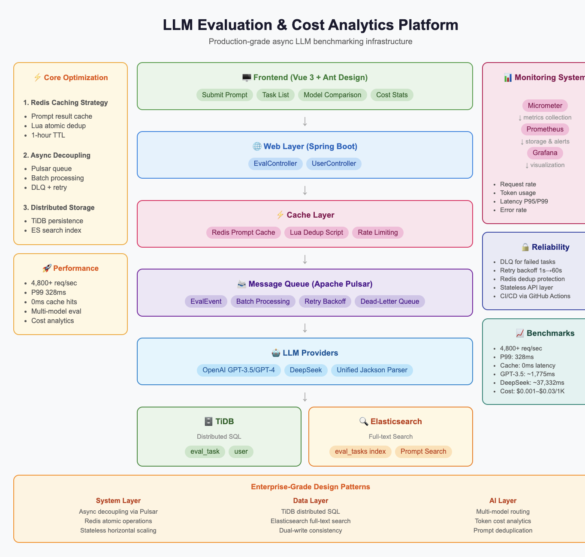
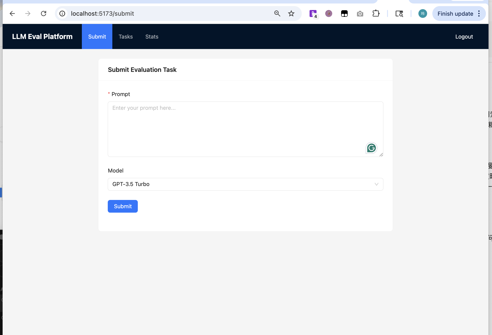
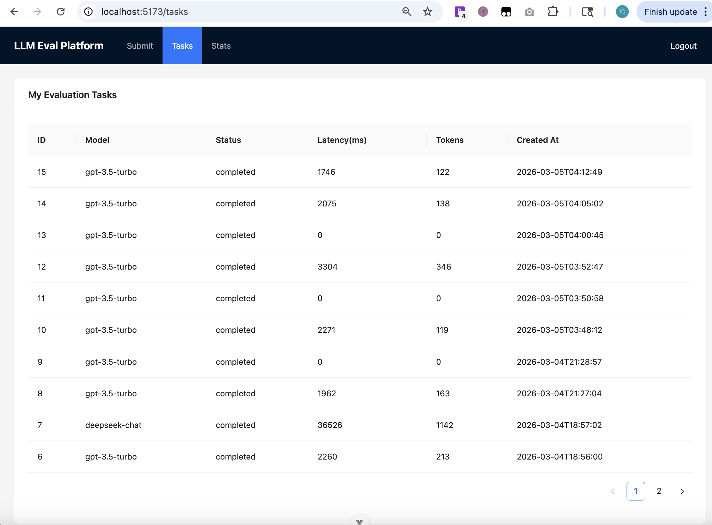
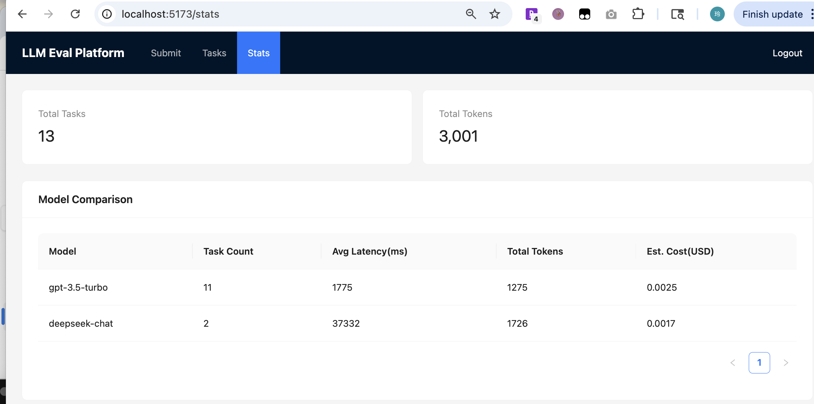
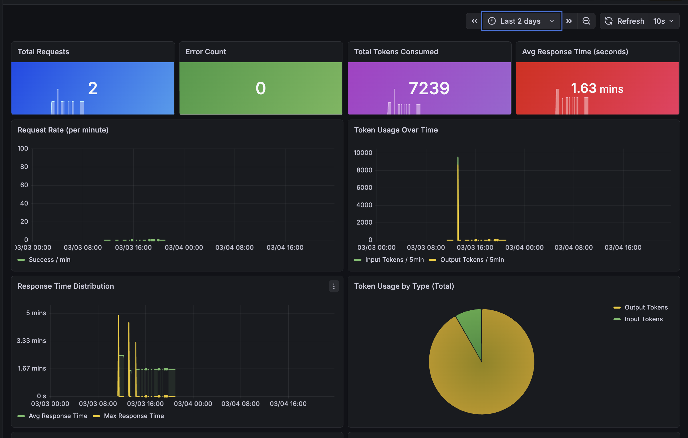

# LLM Evaluation & Cost Analytics Platform

An asynchronous LLM evaluation platform designed to benchmark multiple AI models under identical prompts, tracking latency, token consumption, and estimated cost. Built with production-grade backend infrastructure including Apache Pulsar message queuing, Redis caching, Elasticsearch full-text search, and TiDB distributed database.

---

## Architecture



---

## Tech Stack

| Layer | Technology |
|-------|-----------|
| Backend | Spring Boot 3, Java 21 |
| Message Queue | Apache Pulsar (batch consumption, DLQ, retry backoff) |
| Cache | Redis + Lua scripts |
| Search | Elasticsearch 7.x |
| Database | TiDB (distributed SQL) |
| LLM Providers | OpenAI (GPT-3.5/GPT-4), DeepSeek |
| Observability | Micrometer → Prometheus → Grafana |
| Frontend | Vue 3, Ant Design Vue |
| CI/CD | GitHub Actions |

---

## Key Features

### 1. Async LLM Evaluation Pipeline
- User submits prompt → API returns `taskId` immediately (non-blocking)
- Apache Pulsar queues evaluation tasks for async processing
- Batch consumption (1,000 msgs/batch) with exponential retry backoff (1s→60s)
- Dead-letter queue for permanently failed tasks
- System sustained **4,800+ req/sec (P99 328ms)** under wrk load testing

### 2. Redis Lua Atomic Deduplication
- Prevents duplicate submissions within 60-second window using atomic Lua scripts
- Race condition safe: Redis single-threaded execution guarantees atomicity

### 3. Prompt Result Caching
- Identical prompt+model combinations served from Redis cache (1-hour TTL)
- **Cache hit: 0ms latency, 0 tokens consumed** vs 1,962ms and 163 tokens on first inference
- Eliminates redundant LLM API calls and reduces cost

### 4. Multi-Model Evaluation
- Supports OpenAI (GPT-3.5-turbo, GPT-4) and DeepSeek
- Unified Jackson-based response parsing across providers
- Benchmarks: **GPT-3.5 avg 1,775ms vs DeepSeek avg 37,332ms** under identical prompts

### 5. Cost Analytics API
- Per-model token consumption, average latency, and estimated cost tracking
- Model pricing: $0.001–$0.03 per 1K tokens
- Real-time comparison dashboard

### 6. Elasticsearch Full-Text Search
- Evaluation results indexed into Elasticsearch after completion
- Supports full-text search on prompt content
- Multi-dimensional filtering by model, status, and keywords

---

### Why Async Evaluation?

LLM inference latency ranges from 2–37 seconds depending on provider.
To prevent blocking API requests, evaluation tasks are processed asynchronously via Apache Pulsar.

### Why Redis Lua Scripts?

Atomic Lua scripts prevent race conditions when multiple users submit identical prompts simultaneously.

### Why Elasticsearch?

Evaluation results are indexed into Elasticsearch to enable fast full-text search and analytics over prompt content.

### Why TiDB?

TiDB provides horizontally scalable SQL storage for evaluation results and task metadata.

---

## Screenshots

### Submit Evaluation Task


### Task List with Real-time Status


### Model Comparison & Cost Analytics



###[Grafana Dashboard


---

## Performance Benchmarks

| Metric | Value |
|--------|-------|
| Query endpoint throughput | 4,800+ req/sec |
| P99 latency (query) | 328ms |
| Cache hit latency | 0ms |
| Cache miss latency (GPT-3.5) | ~1,775ms avg |
| DeepSeek avg latency | ~37,332ms |
| Token savings on cache hit | 100% |

---

## Getting Started

### Prerequisites
- Java 21
- Docker
- Node.js 18+

### 1. Start Infrastructure

```bash
# Start Pulsar
docker run -d --name pulsar \
  -p 6650:6650 -p 8080:8080 \
  apachepulsar/pulsar:3.3.0 \
  bin/pulsar standalone

# Start TiDB + MySQL
docker-compose up -d

# Start Elasticsearch
docker start elasticsearch
```

### 2. Configure Application

Create `src/main/resources/application-local.yml`:

```yaml
deepseek:
  api-key: your-deepseek-key

openai:
  api-key: your-openai-key
```

### 3. Initialize Database

```sql
CREATE DATABASE thumb_db;
USE thumb_db;
-- Run sql/create_table.sql
```

### 4. Run Backend

```bash
./mvnw spring-boot:run
```

### 5. Run Frontend

```bash
cd frontend
npm install
npm run dev
```

---

## API Endpoints

| Method | Endpoint | Description |
|--------|----------|-------------|
| POST | `/api/eval/submit` | Submit evaluation task |
| GET | `/api/eval/task/{id}` | Get task result |
| GET | `/api/eval/list` | List all tasks |
| GET | `/api/eval/stats` | Cost & latency analytics |
| GET | `/api/eval/search` | Full-text search (ES) |

### Submit Task Example

```bash
curl -b cookies.txt -X POST http://localhost:9199/api/eval/submit \
  -H "Content-Type: application/json" \
  -d '{"promptText": "What is Apache Kafka?", "modelName": "gpt-3.5-turbo"}'
```

### Search Example

```bash
# Full-text search
curl -b cookies.txt "http://localhost:9199/api/eval/search?keyword=kafka"

# Filter by model
curl -b cookies.txt "http://localhost:9199/api/eval/search?modelName=gpt-3.5-turbo"
```

---

## CI/CD

GitHub Actions pipeline automatically builds and verifies on every push to `main`.

```
Push to main → Maven build → JAR artifact upload
Build time: ~41 seconds
```

---

## Project Structure

```
src/main/java/com/yuyuan/thumb/
├── controller/
│   └── EvalController.java        # REST API endpoints
├── listener/eval/
│   ├── EvalConsumer.java          # Pulsar consumer + LLM calls
│   └── EvalDlqConsumer.java       # Dead-letter queue handler
├── model/entity/
│   ├── EvalTask.java              # TiDB entity
│   └── EvalTaskDocument.java      # Elasticsearch document
├── repository/
│   └── EvalTaskEsRepository.java  # ES repository
├── service/
│   └── EvalTaskService.java       # Business logic
└── constant/
    └── RedisLuaScriptConstant.java # Lua scripts
```

---

## License

MIT
